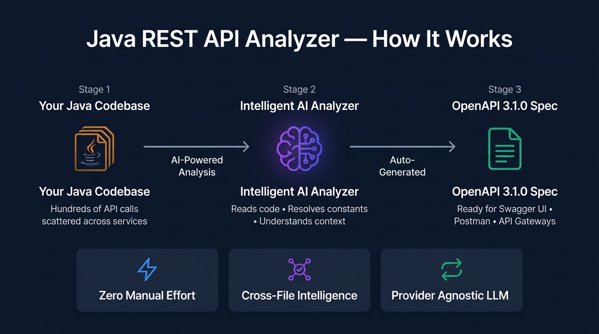
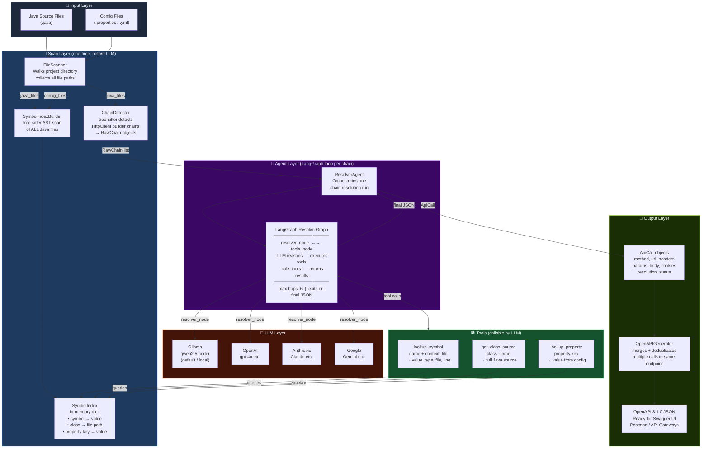
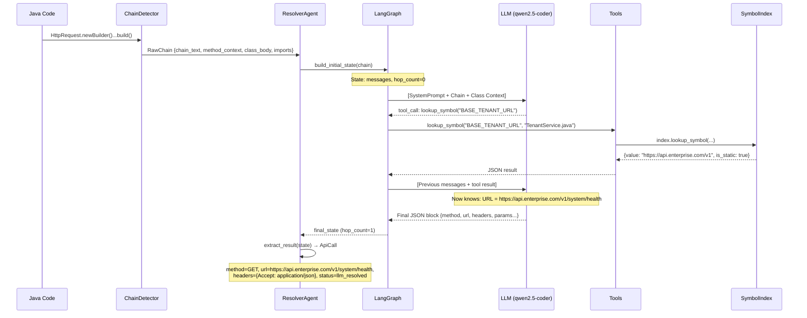
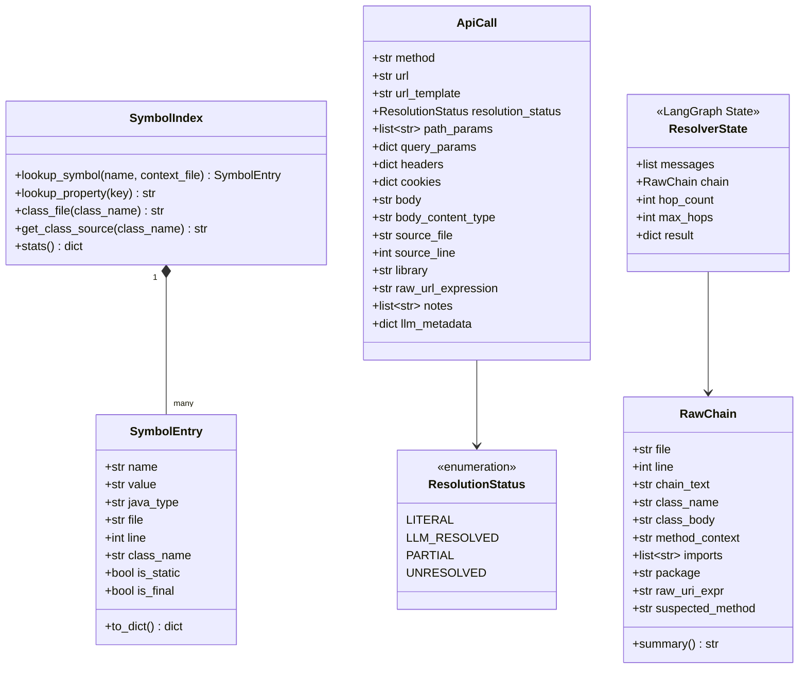
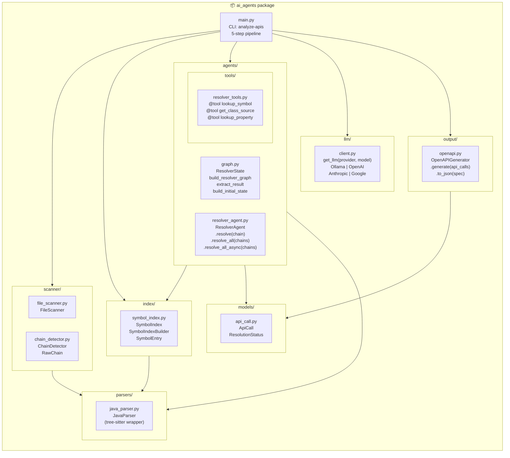
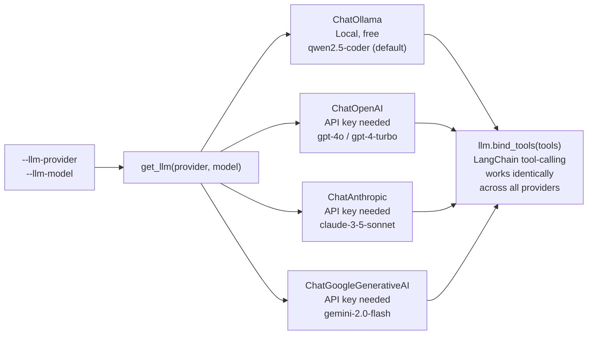

# Java REST API Analyzer — Architecture Handover

> **Version:** 2.0 (Agentic Rebuild)  
> **Date:** 2026-07-08  
> **Repository:** [akshaymone/ai-agnets](https://github.com/akshaymone/ai-agnets)  
> **Status:** ✅ Live & tested — 4/4 real-world scenarios passing (Ollama / qwen2.5-coder)

---

## Part 1 — Functional Overview (for Stakeholders)

### What problem does this solve?

Modern Java services make **hundreds of outbound REST API calls** — to payment providers, notification services, internal microservices, etc. These calls are scattered across thousands of lines of code. Keeping API documentation accurate and up-to-date is:

- ❌ **Manual** — engineers must read the code and write docs by hand
- ❌ **Incomplete** — base URLs are often stored in constants in other classes
- ❌ **Stale** — docs drift from reality as code changes

### What does the analyzer do?



### Business Value

| Before | After |
|--------|-------|
| Engineers manually read code + write API docs | Tool auto-generates docs by reading code |
| Constants in other classes → URL unknown | AI resolves cross-file constants automatically |
| Docs go stale with every code change | Re-run the tool to refresh docs instantly |
| OpenAPI spec requires expert knowledge | Any Java project → spec in one command |

### Key Capabilities

- 🔍 **Reads Java code** — understands HttpClient builder patterns at the AST level
- 🧠 **Resolves constants** — finds `static final String BASE_URL = "..."` even if it's in a different class
- 📋 **Reads config files** — resolves `@Value("${api.base-url}")` from `.properties`/`.yml`
- 🔄 **Iterative reasoning** — AI asks for more context if it can't resolve something on first pass
- 📄 **OpenAPI 3.1.0 output** — compatible with Swagger UI, Postman, API Gateways

---

## Part 2 — Technical Architecture (for Engineers)

### System Overview



---

### The Agentic Loop — Detail

This is the core of the system. For every detected API call, the LLM runs in a loop:



> **Loop termination conditions:**
> - ✅ LLM emits final JSON block (no more tool calls) → **DONE**
> - ⚠️ Same symbol requested twice → **exit with partial result**
> - ⚠️ `hop_count >= max_hops` (default: 6) → **force exit with partial result**
> - ❌ LLM/network error → **fallback ApiCall with UNRESOLVED status**

---

### Data Model



---

### Module Structure



---

### Pipeline — Step by Step

| Step | Module | Input | Output | Time |
|------|--------|-------|--------|------|
| 1 | `FileScanner` | Project root path | `.java` file list, config file list | ~instant |
| 2 | `SymbolIndexBuilder` | All `.java` + config files | `SymbolIndex` (in-memory) | ~1-5s for large codebases |
| 3 | `ChainDetector` | All `.java` files | `List[RawChain]` | ~1-3s |
| 4 | `ResolverAgent` (LangGraph) | Each `RawChain` + `SymbolIndex` | `ApiCall` per chain | ~2-10s per chain (LLM) |
| 5 | `OpenAPIGenerator` | `List[ApiCall]` | OpenAPI 3.1.0 JSON | ~instant |

> **Performance note:** Steps 1–3 are pure Python/tree-sitter (no LLM). Step 4 is the only LLM-dependent step. With `--async`, all chains are resolved in parallel.

---

### LLM Provider Strategy



> All providers produce identical output — the `ResolverAgent` and `LangGraph` code is 100% provider-agnostic. Switch providers with one CLI flag, no code changes.

---

### CLI Reference

```bash
# Basic (Ollama must be running locally)
analyze-apis /path/to/java/project

# Save spec to file
analyze-apis /path/to/project -o openapi.json

# Use OpenAI instead of Ollama
analyze-apis /path/to/project \
  --llm-provider openai \
  --llm-model gpt-4o

# More hops for complex cross-file resolution
analyze-apis /path/to/project --max-hops 8

# Parallel (faster for large codebases)
analyze-apis /path/to/project --async

# Full options
analyze-apis /path/to/project \
  --llm-provider ollama \
  --llm-model qwen2.5-coder \
  --max-hops 6 \
  --temperature 0.0 \
  --title "My Service APIs" \
  --api-version 2.1.0 \
  --async \
  -v \
  -o openapi.json
```

---

### Resolution Status Values

| Status | Meaning | Example |
|--------|---------|---------|
| `literal` | URL was a hardcoded string | `URI.create("https://api.example.com/users")` |
| `llm_resolved` | LLM used tools to resolve constants/properties | `BASE_URL + "/health"` → `https://api.enterprise.com/v1/health` |
| `partial` | LLM resolved some fields but not all | URL known, one header value unknown |
| `unresolved` | Could not determine URL (LLM error, network, or truly unknowable) | Method parameter with no traceable value |

---

### What the LLM Sees (Prompt Design)

The LLM receives, **in this order**:
1. **System prompt** — strict instructions: always call `lookup_symbol()` for any URL variable before answering; output a specific JSON schema; never emit `null` for array/dict fields
2. **Enclosing Method body** — the full Java method that contains the builder chain *(new in v2.1)*. This is the most critical context piece: it shows local variable assignments like `String endpoint = BASE_URL + "/users/" + userId + ...` that would otherwise be invisible to the LLM
3. **Builder chain code** — the exact source of the `HttpRequest.newBuilder()...build()` call
4. **Full class context** — up to 4,000 chars of the enclosing class (so it sees field declarations like `static final String BASE_URL = ...`)
5. **Import statements** — to understand cross-class references
6. **Tool results** — injected as `ToolMessage` nodes in the conversation as the loop runs

> **Why Enclosing Method first?** Local variables (e.g. `endpoint`, `fullUrl`, `resourcePath`) are defined in the method body, not in the `SymbolIndex`. If the LLM only sees `URI.create(endpoint)` without seeing `String endpoint = ...`, it guesses wrong. By placing the full method first, the LLM has the complete picture before it even looks at anything else.

The LLM must respond with a strict JSON block:
```json
{
  "method": "GET",
  "url": "https://api.enterprise.com/v1/users/{userId}/documents",
  "url_template": "/v1/users/{userId}/documents",
  "host": "api.enterprise.com",
  "scheme": "https",
  "path_params": ["userId"],
  "query_params": {"filter": "{status}"},
  "headers": { "Authorization": "Bearer token-123" },
  "cookies": {},
  "body": null,
  "body_content_type": null,
  "resolution_status": "llm_resolved",
  "notes": ["userId and status are method parameters"]
}
```

> **Important:** Every array/object field must be present and non-null. The system defensively coerces any `null` the LLM emits to `[]` / `{}` before Pydantic validation.

---

### Robustness & Edge Cases

The pipeline is designed to **never crash and never silently drop a detected call**:

| Failure scenario | What happens |
|------------------|--------------|
| LLM emits `"query_params": null` | `_as_dict()` coercion in `extract_result()` converts to `{}` — Pydantic never sees `None` |
| LLM emits `"url": ""` (blank) | Falls back to `chain.raw_uri_expr` — the call is never lost |
| URL still empty after fallback | OpenAPI generator places call at `/unresolved/<raw_expr_slug>` with a `WARNING` log |
| LLM error / network timeout | `ResolverAgent` catches exception, returns `ApiCall(resolution_status=UNRESOLVED)` with error in `notes` |
| Max hops reached | Graph exits, `extract_result()` parses whatever the last AI message contains |
| LLM resolves local variable to wrong method's URL | Fixed by `method_context` — enclosing method body is in the prompt, so the LLM always traces the right variable |

---

### Test Fixtures

| File | Purpose | Scenarios Covered |
|------|---------|-------------------|
| `tests/java_samples/ApiService.java` | Original 10-pattern test file | Literal URLs, query params, cookies, multi-headers, `.method()`, `newBuilder(URI)` |
| `tests/java_samples/TenantService.java` | Real-world cross-class scenario | Cross-class constants, same-class constants, dynamic path params, header with constant key |
| `tests/java_samples/ApiConstants.java` | Companion constants class | `BASE_TENANT_URL`, `INTERNAL_BASE_URL`, `API_KEY_HEADER` |

---

### Glossary

| Term | Definition |
|------|-----------|
| **tree-sitter** | A parser generator that builds an AST (Abstract Syntax Tree) from source code. Handles any code style, indentation, multiline expressions. |
| **AST** | Abstract Syntax Tree — a structured representation of code that the analyzer traverses to find patterns |
| **HttpClient builder chain** | Java 11+ fluent API: `HttpRequest.newBuilder().uri(...).header(...).GET().build()` |
| **RawChain** | Our data structure representing a single detected builder chain, before any LLM resolution |
| **SymbolIndex** | In-memory dictionary of all `static final` field values, class→file mappings, and config properties, built before the LLM loop starts |
| **LangGraph** | Python library for building stateful, cyclic agent graphs. Manages the `resolver_node ↔ tools_node` loop |
| **ReAct** | Reasoning + Acting — the AI paradigm where the LLM alternates between reasoning (what do I need?) and acting (call a tool) |
| **Hop** | One round-trip through the resolver loop: LLM calls a tool → tool returns result → LLM sees result |
| **OpenAPI 3.1.0** | Industry-standard API specification format. Compatible with Swagger UI, Postman, AWS API Gateway, etc. |
| **Tool-calling** | LLM feature where the model can request execution of a defined function (our `lookup_symbol` etc.) |

---

> [!NOTE]
> **For new engineers joining the project:** Start with [`chain_detector.py`](https://github.com/akshaymone/ai-agnets/blob/main/src/ai_agents/scanner/chain_detector.py) to understand how chains are detected, then [`graph.py`](https://github.com/akshaymone/ai-agnets/blob/main/src/ai_agents/agents/graph.py) to understand the agentic loop.

> [!IMPORTANT]
> **To add a new Java HTTP library** (e.g. RestTemplate, OkHttp): create a new `ChainDetector`-equivalent that detects that library's patterns and emits `RawChain` objects. The rest of the pipeline (SymbolIndex, ResolverAgent, OpenAPIGenerator) works unchanged.

> [!TIP]
> **To swap from Ollama to OpenAI:** just change `--llm-provider openai --llm-model gpt-4o`. GPT-4o and Claude are significantly better at multi-step tool-calling and will typically resolve in fewer hops.
